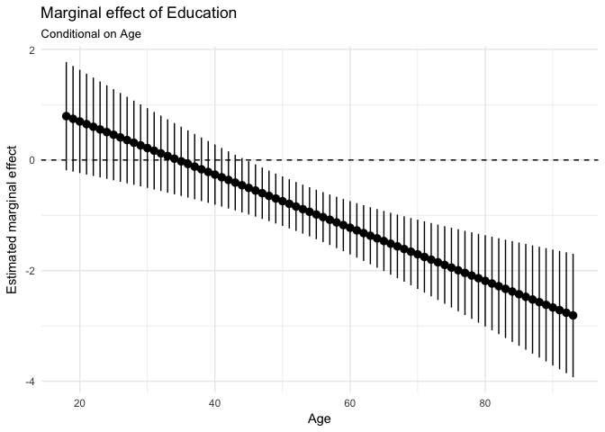

Regression diagnostics
======================

    ## 
    ## Call:
    ## lm(formula = biden ~ age + female + educ, data = df_biden)
    ## 
    ## Residuals:
    ##    Min     1Q Median     3Q    Max 
    ##  -67.1  -14.7    0.7   18.9   45.1 
    ## 
    ## Coefficients:
    ##             Estimate Std. Error t value Pr(>|t|)    
    ## (Intercept)  68.6210     3.5960   19.08  < 2e-16 ***
    ## age           0.0419     0.0325    1.29      0.2    
    ## female        6.1961     1.0967    5.65  1.9e-08 ***
    ## educ         -0.8887     0.2247   -3.96  7.9e-05 ***
    ## ---
    ## Signif. codes:  0 '***' 0.001 '**' 0.01 '*' 0.05 '.' 0.1 ' ' 1
    ## 
    ## Residual standard error: 23.2 on 1803 degrees of freedom
    ## Multiple R-squared:  0.0272, Adjusted R-squared:  0.0256 
    ## F-statistic: 16.8 on 3 and 1803 DF,  p-value: 8.88e-11

*β*0 for intercept of the multiple linear regression is
68.6210 and standard error is 3.5960 and *β*1 for age is
0.0419 and standard error is 0.0325. *β*2 for gender is
6.1961 and standard error is 1.0967 and *β*3 for education is
-0.8887 and standard error is 0.2247.

1
=

    ## [1] 167

From above Bubble plot, we can observe 167 unusual and influential
obseravations. Here, orange bubble means high Cooks D and grey bubble
means low Cooks D. We can see that these unusual and influential
obsearvations located in lower left side of Bubble plot. It means that
they have high discrepancy and low leverage. Let's try digging into the
history of the observation to find out what causes this situation.

From previous homeworks, we already knew that biden feeling is somewhat
related with party affiliation. When we draw histogram of the data set
by Party affiliation, Republican has the smallest portion in the data
set, but the proportion of influential observations in Republican group
is higher than other two parties. It indicates that Party affiliation
may affects on unusual observations. Thus, moving forward with this
research, I will additionally collect the variables 'dem' and 'rep' to
control for unusual influential effect.

2
=

The dashed lines in quantile-comparison plot indicate 95% confidence
intervals calculated under the assumption that the errors are normally
distributed. We can see that there are observations fall outside this
range, thus this indicates the assumption of normality has been
violated.If the data is not normally distributed, then power and log
transformations of response are typically used to correct the violation.

3
=

    ## 
    ##  studentized Breusch-Pagan test
    ## 
    ## data:  biden_lm
    ## BP = 20, df = 3, p-value = 5e-05

From the graph, wee can see a distinct decreasing shape to the
relationship between the predicted values and the residuals. As the
predicted values increases, the residuals decreased. We can say that the
data has non-constant error variance. From the Breusch-Pagan test, The
resulting statistic p-value is 5e-05, so it is statistically
significant. Thus we reject the null hypothesis that the data has
constant variance. We conclude that heteroscedasticity is present in the
data. This violation leads the estimates of the standard errors to
measure inaccurate - they will either be inflated or deflated, leading
to incorrect inferences about the statistical significance of predictor
variables.

4
=

    ##    age female   educ 
    ##   1.01   1.00   1.01

Above correlation matrices shows that there is no multicollinearity in
this model. From variance inflation factor(VIF) scores, no scores are
greater than 10, we can also say that there is no multicollinearity in
this model.

Interaction terms
=================

    ## 
    ## Call:
    ## lm(formula = biden ~ age + educ + age * educ, data = df_biden)
    ## 
    ## Residuals:
    ##    Min     1Q Median     3Q    Max 
    ## -70.54 -12.24  -0.94  20.50  44.74 
    ## 
    ## Coefficients:
    ##             Estimate Std. Error t value Pr(>|t|)    
    ## (Intercept)  38.3735     9.5636    4.01  6.3e-05 ***
    ## age           0.6719     0.1705    3.94  8.4e-05 ***
    ## educ          1.6574     0.7140    2.32    2e-02 *  
    ## age:educ     -0.0480     0.0129   -3.72    2e-04 ***
    ## ---
    ## Signif. codes:  0 '***' 0.001 '**' 0.01 '*' 0.05 '.' 0.1 ' ' 1
    ## 
    ## Residual standard error: 23.3 on 1803 degrees of freedom
    ## Multiple R-squared:  0.0176, Adjusted R-squared:  0.0159 
    ## F-statistic: 10.7 on 3 and 1803 DF,  p-value: 5.37e-07

*β*0 for intercept of the multiple linear regression is
38.3735 and standard error is 9.5636 and *β*1 for age is
0.6719 and standard error is 0.1705. *β*2 for education is
1.6574 and standard error is 0.7140 and *β*3 for
age\*education is -0.0480 and standard error is 0.0129.

1
=

    ## Linear hypothesis test
    ## 
    ## Hypothesis:
    ## age  + age:educ = 0
    ## 
    ## Model 1: restricted model
    ## Model 2: biden ~ age + educ + age * educ
    ## 
    ##   Res.Df    RSS Df Sum of Sq    F Pr(>F)    
    ## 1   1804 985149                             
    ## 2   1803 976688  1      8461 15.6  8e-05 ***
    ## ---
    ## Signif. codes:  0 '***' 0.001 '**' 0.01 '*' 0.05 '.' 0.1 ' ' 1

We can observe that the magnitude and direction of Age go down and below
0 . From Hypothesis testing the p-value is 8e-05, so we can conclude
that the marginal effect of age is statistically significant.

2
=

    ## Linear hypothesis test
    ## 
    ## Hypothesis:
    ## educ  + age:educ = 0
    ## 
    ## Model 1: restricted model
    ## Model 2: biden ~ age + educ + age * educ
    ## 
    ##   Res.Df    RSS Df Sum of Sq    F Pr(>F)  
    ## 1   1804 979537                           
    ## 2   1803 976688  1      2849 5.26  0.022 *
    ## ---
    ## Signif. codes:  0 '***' 0.001 '**' 0.01 '*' 0.05 '.' 0.1 ' ' 1

We can observe that the magnitude and direction of Education go down and
below 0 in the above plot. From Hypothesis testing the p-value is 0.022,
so we can conclude that the marginal effect of age is statistically
significant.

Missing data
============

First, consider the multivariate normality assumption, we conduct
Henze-Zirkler' Multivariate Normality Test and Shapiro-Wilk Multivariate
Normality test to see out data set distributed as a multivariate normal
distribution. Since female is a binary variable, we will test only age
and educ variabels are distributed multivariate normally or not.

    ##   Henze-Zirkler's Multivariate Normality Test 
    ## --------------------------------------------- 
    ##   data : biden_nom 
    ## 
    ##   HZ      : 17 
    ##   p-value : 0 
    ## 
    ##   Result  : Data are not multivariate normal. 
    ## ---------------------------------------------

    ## $`Descriptive Statistics`
    ## NULL
    ## 
    ## $`Shapiro-Wilk's Normality Test`
    ##    Variable Statistic   p-value Normality
    ## 1    age        0.980         0    NO    
    ## 2   educ        0.918         0    NO

From above two results, we can see that the data set does not
distributed multivariate normally and also the age and education
variabels are not normally distributed itself. We can try power
transformation for square root as trial and error.

    ## [1] "After transformation"

    ##   Henze-Zirkler's Multivariate Normality Test 
    ## --------------------------------------------- 
    ##   data : biden_nom3 
    ## 
    ##   HZ      : 15.3 
    ##   p-value : 0 
    ## 
    ##   Result  : Data are not multivariate normal. 
    ## ---------------------------------------------

    ## $`Descriptive Statistics`
    ## NULL
    ## 
    ## $`Shapiro-Wilk's Normality Test`
    ##    Variable Statistic   p-value Normality
    ## 1 sqrt_age      0.984         0    NO    
    ## 2 sqrt_educ     0.864         0    NO

Testing again with squared transformation of response, still it is not
distributed multivariate normally, but the HZ statistic is bit
mitigated. With above transformation, we will calcualte appropriate
estimates of the parameters and the standard errors and see how the
results differ from the original, non-imputed model.

    ## # A tibble: 20 × 6
    ##       id        term estimate std.error statistic   p.value
    ##    <chr>       <chr>    <dbl>     <dbl>     <dbl>     <dbl>
    ## 1   imp1 (Intercept)  63.8118    2.9807     21.41  6.19e-93
    ## 2   imp1         age   0.0377    0.0276      1.37  1.72e-01
    ## 3   imp1      female   6.0213    0.9589      6.28  4.04e-10
    ## 4   imp1        educ  -0.5381    0.1847     -2.91  3.62e-03
    ## 5   imp2 (Intercept)  65.2828    3.0004     21.76  1.14e-95
    ## 6   imp2         age   0.0501    0.0277      1.81  7.06e-02
    ## 7   imp2      female   6.0166    0.9641      6.24  5.16e-10
    ## 8   imp2        educ  -0.6857    0.1860     -3.69  2.32e-04
    ## 9   imp3 (Intercept)  66.6340    3.0287     22.00  1.38e-97
    ## 10  imp3         age   0.0407    0.0282      1.45  1.49e-01
    ## 11  imp3      female   5.8465    0.9805      5.96  2.86e-09
    ## 12  imp3        educ  -0.7221    0.1882     -3.84  1.27e-04
    ## 13  imp4 (Intercept)  68.5374    2.9987     22.86 1.91e-104
    ## 14  imp4         age   0.0524    0.0279      1.88  6.02e-02
    ## 15  imp4      female   5.3861    0.9696      5.55  3.10e-08
    ## 16  imp4        educ  -0.8984    0.1860     -4.83  1.45e-06
    ## 17  imp5 (Intercept)  66.4051    2.9670     22.38 1.30e-100
    ## 18  imp5         age   0.0507    0.0275      1.84  6.53e-02
    ## 19  imp5      female   5.6317    0.9571      5.88  4.59e-09
    ## 20  imp5        educ  -0.7317    0.1842     -3.97  7.31e-05

    ## [1] "Comparison between imputed model and original model"

    ##          term estimate std.error estimate.mi std.error.mi
    ## 1 (Intercept)  68.6210    3.5960     66.1342       3.5547
    ## 2         age   0.0419    0.0325      0.0463       0.0287
    ## 3      female   6.1961    1.0967      5.7804       1.0110
    ## 4        educ  -0.8887    0.2247     -0.7152       0.2332

From above results, table and plot, we can see that there is no
significant differences in the estimated coefficients and standard
errors between imputed model and original, non-imputed model. From
missingmap, and amelia function, we can see that there are not many
missing variabels so it explains why the differences are not
significant.
